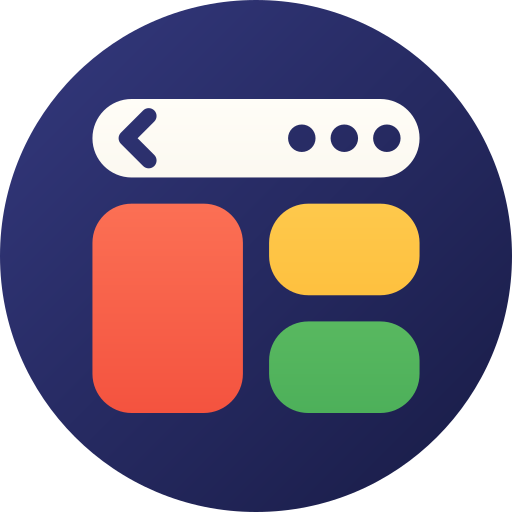
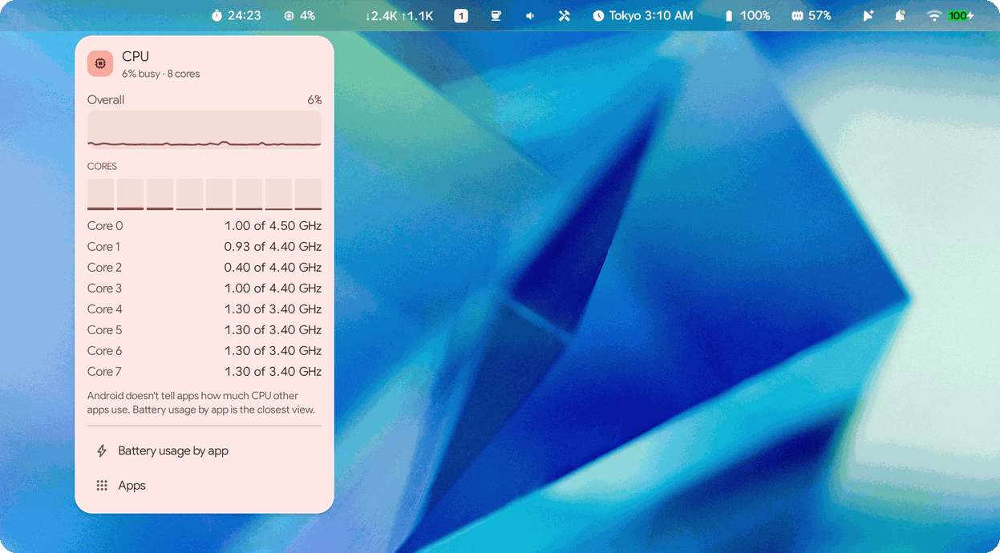
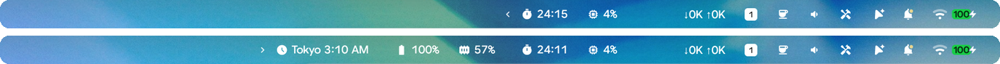
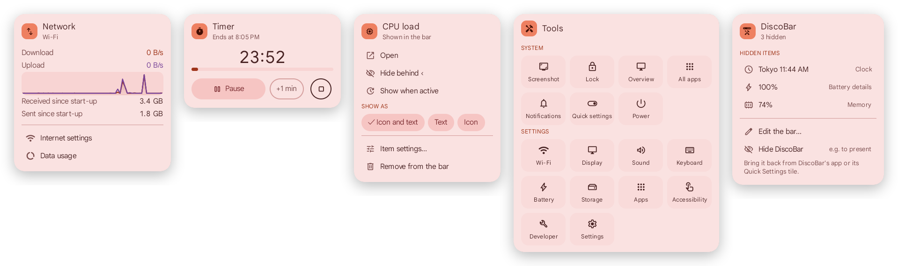
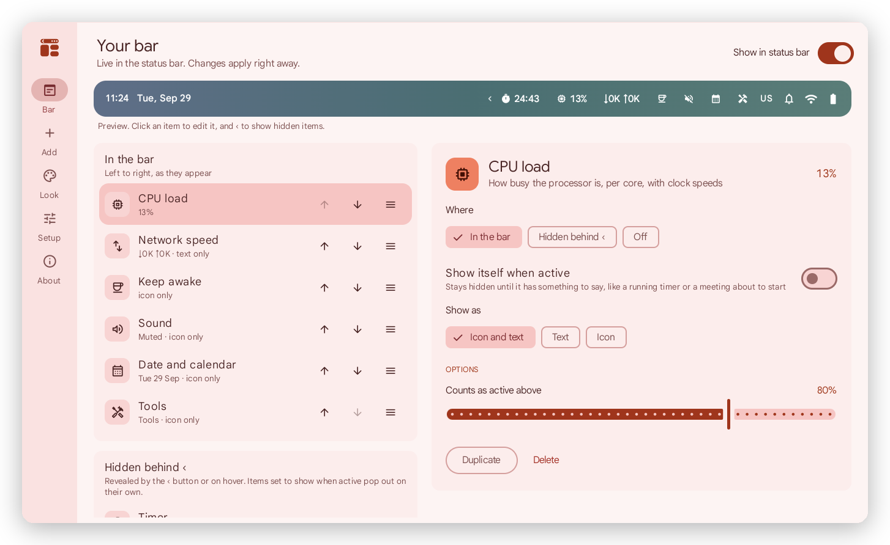
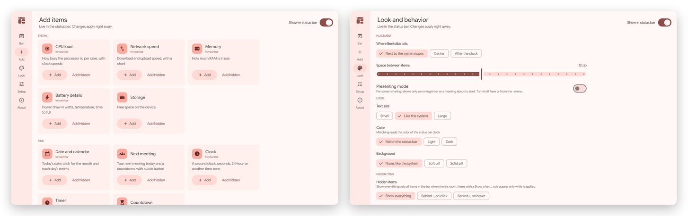

<p align="center">
  
</p>

<h1 align="center">BentoBar</h1>

<p align="center">
  <b>Add, hide and organise items in your Googlebook's status bar.</b><br>
  What Bartender and iStat Menus do for the Mac menu bar, as an ordinary Android app: no root, no adb.
</p>

<p align="center">
  <a href="../../releases/latest/download/BentoBar.apk"><b>⬇ Download BentoBar.apk</b></a>
  &nbsp;·&nbsp; <a href="#install">Install</a>
  &nbsp;·&nbsp; <a href="#privacy">Privacy</a>
  &nbsp;·&nbsp; <a href="CHANGELOG.md">What's new</a>
</p>

<p align="center">
  
  
  
  
</p>

<p align="center"><sub>A personal hobby project by Fika Labs, proudly developed on a Googlebook.
Not affiliated with or endorsed by any employer (<a href="#about-this-project">more</a>).
Formerly DiscoBar (<a href="#coming-from-discobar">moving over</a>).</sub></p>

<p align="center">
  
</p>

## What it does

BentoBar puts **your own items** into the empty part of the status bar, right next to the
system's icons, in the same font and colour. Items you don't need all the time can show only while
they have something to say, or wait **behind the ‹ button**: one click reveals them, another folds
them away. Like a bento box: everything in its compartment, and the whole thing neat.

<p align="center">
  
  <br><sub>With hidden items behind ‹ (a Look setting; the default shows everything that fits), folded (top) and revealed (bottom): a world clock, battery and memory slide in next to the running timer.</sub>
</p>

- **Show when active:** a hidden item can pop out on its own while it has something to say, such
  as a running timer, a meeting about to start or a busy CPU, and disappear again after. Its
  settings say the rule in words ("Show when CPU load is above 80%") and let you set the number.
- **Drag to reorder** in settings, within a section or into another one.
- **Click any item** for its menu: charts, details and actions.
- **Right-click an item** to hide it, move it or change how it looks.
- **Scroll** over the sound item to change the volume, or over the timer to add minutes. The sound
  item can also draw a **volume slider** right in the bar.
- **Quick Settings tiles** switch BentoBar off (for presenting), keep the screen awake, or start a
  25-minute timer.
- **Live Update chip:** when BentoBar is off, a running timer still shows as Android's own status
  bar chip.

BentoBar stays out of the way. It moves aside when the system's own icons or chips change, and
hides when an app goes full screen or the screen locks.

## Items

| Item | In the bar | In its menu |
|---|---|---|
| **CPU load** | busy %; can also pop out when the device runs hot | chart, per-core load, clock speeds, GPU load |
| **Network speed** | ↓ download ↑ upload | chart, totals since start-up, connection |
| **Memory** | RAM in use | used, available, chart |
| **Battery details** | watts, %, temperature or time to full | power in or out, voltage, current, health, cycles, thermal state |
| **Storage** | free space | used and free, shortcuts to clean up |
| **Date and calendar** | the date, in your format | a month view, and the day's events (all-day ones too) with **Join** and **Directions**; tasks that apps like Todoist sync to your calendar are left out, here and in Next meeting |
| **Next meeting** | title and countdown, until 3 a.m. tomorrow; just the icon when there are no more meetings | today's meetings with **Join** and **Directions** |
| **Clock** | a second clock: seconds, 24-hour or another city | world clocks: add cities in the menu, and **Plan a time**, a slider that shows any time of day in every city (copy the line, or start a calendar event there) |
| **Timer** | countdown, stopwatch or Pomodoro | start, pause, +1 min, stop |
| **Countdown** | days and hours to a date | exact time left |
| **Keep awake** | coffee cup: click to switch | 15 min to "until I turn it off" |
| **Sound** | volume, as a number or as a slider you click or drag | volume slider, play/pause/next |
| **Now playing** | the title while something plays | artwork, position, previous, play and next, other players. The title needs notification access (optional); without it the item still shows that something plays and controls it |
| **Device batteries** | the lowest of your mouse, keyboard, stylus or controller, when it's low | every device that reports a battery |
| **Heat** | a word when Android slows a hot device | heat level, battery temperature |
| **Weather** *(online)* | conditions and temperature of a city you pick or of where you are; rain or snow that is coming; optionally a word for the sky ("Partly cloudy", "Windy") | the next hours and days, sunrise and sunset. From [Open-Meteo](https://open-meteo.com) |
| **Flight** *(online)* | a line with the plane where the flight is, a countdown to departure with the gate, then to landing, and delays | times at both airports, terminal, gate, baggage belt; a choice where a number flies more than once a day. From AirLabs, with a free key of your own |
| **Tools** | toolbox | screenshot, lock, overview, all apps, power, settings shortcuts |
| **App folder** / **App shortcut** | your apps | a grid of apps / one click to open |
| **Text or emoji**, **Spacer** | anything you like | optional link |

<p align="center">
  
</p>

## Settings

A live preview of your bar at the top; below it, your items in three groups (**in the bar**,
**hidden** and **off**; drag a row to move it) with each item's options on the right. Changes apply to the
status bar right away.

<p align="center">
  
</p>

<p align="center">
  
  <br><sub>Adding items, and choosing where BentoBar sits and how it looks.</sub>
</p>

## Install

BentoBar is made for Googlebooks (Googlebook OS, Android 17). Other Android 14+ devices with a
status bar may work, but haven't been tested.

1. On your Googlebook, download
   **[BentoBar.apk](../../releases/latest/download/BentoBar.apk)** from the latest release.
2. Open it from Chrome's downloads or the Files app. If Android asks, allow Chrome (or Files) to
   install apps, then tap **Install**. Google Play Protect may then say *"App blocked to protect
   your device"* because it hasn't seen an app from this developer before: tap **More details** ›
   **Install anyway**.
3. Open **BentoBar**. It says what its accessibility service does and asks whether you agree:
   **Agree** opens Android's Accessibility settings. (Later, the same is under **Setup** › **Turn on**.)
4. Because BentoBar came from a download, Android guards this switch the first time:
   1. Open **BentoBar** and tap the switch. Android says *"Restricted setting"*. Tap **OK**.
   2. Back in BentoBar, open **Setup** and tap **App info**, then **⋮** (top right) › **Allow restricted
      settings**, and confirm with your PIN.
   3. Return to Accessibility › **BentoBar** and turn it on.
5. Optional: in **Setup**, allow notifications (timer alerts, the Live Update chip) and calendar
   access (Next meeting, events in the month view).

About a day later, Android shows *"Review app with full device access"*. That's a standard check
for every app that uses an accessibility service. Keep BentoBar if you're happy with what it does
(below).

To update, install a newer `BentoBar.apk` over the old one; your layout stays.

### Coming from DiscoBar?

BentoBar is DiscoBar's new name (from version 0.5). It's a new package, so it installs next to
DiscoBar rather than over it. To bring your layout along:

1. In **DiscoBar**, open **Look › Copy settings**.
2. Install and open **BentoBar**, then **Look › Paste settings**.
3. Turn BentoBar on in **Setup**, and uninstall DiscoBar (otherwise both draw in the status bar).

<a id="privacy"></a>
## Privacy: why an accessibility service, and what BentoBar does with it

Android lets an app draw on top of the status bar only through an accessibility service, so
Android warns that BentoBar can "view and control your screen". Here is everything BentoBar does
with that access:

- It listens only for **windows appearing, going or moving**, not their content, so it can hide
  for full-screen apps and shades.
- It reads the **status bar's layout, and no other window**, to find free space.
- It copies the **colour of the status bar clock**, from a picture of the status bar's own window
  (not your screen), so your items match.
- It runs **system actions** (screenshot, lock, overview, all apps, power) when you pick them in
  the Tools menu.

BentoBar doesn't read other apps' windows and doesn't watch your keyboard, mouse or touches.

**BentoBar goes online for two items only, and only after you set them up** on this device:

- **Weather** sends [Open-Meteo](https://open-meteo.com) the city you search for, and for the forecast
  the coordinates of the city you pick, rounded to about a kilometre: about every 30 minutes while the
  bar is on screen, and when you open its menu or press Refresh. Open-Meteo sees your IP address, as
  any website does. With **My location** instead of a city, BentoBar asks Android for the device's
  approximate location (never the precise one) while that item is in the bar: every 30 minutes once it
  knows, and when Android doesn't, again after 1, 2, 5 and 15 minutes, then every 30. It sends
  Open-Meteo that location rounded to about 10 km. Android's "while using the app" permission is
  enough for that, since the status bar counts as in use. Where you are, and its forecast, are kept
  in memory only: never on the device, in your layout or in its backup.
- **Flight** sends [AirLabs](https://airlabs.co) the flight number and your own AirLabs key: when you
  track a flight, when you press Refresh, and while it follows the flight (about every 3 hours, then
  every 30 minutes or sooner from 3 hours before departure until it lands). AirLabs sees your IP
  address and can tie lookups to your key's account. BentoBar ships no key.

Requests can go to those two services and nowhere else (the code has no way to name another
address), **Setup › Online services** switches each off, and a layout pasted from another install
never turns them on. BentoBar sends nothing else anywhere: not your layout, your calendar, what's
playing or anything it measures. It has no accounts of its own, no ads and no analytics, and it
sends its developer nothing.

**Now playing** reads the title, artist and artwork your media players publish, which Android shares
only with apps that have notification access. That access is optional, and BentoBar tells Android to
send it no notifications: it receives none. Without it the item still shows that something plays and
controls it. Nothing about what you play is stored or sent.

If you use Android's backup, Android keeps a copy of BentoBar's settings in your Google account. Your
AirLabs key and the two online switches are left out of it.

**Usage access is optional and off by default.** If you turn it on (Setup, or the Network and
Storage menus), BentoBar reads how much data and storage each app uses, to list the top five in
those menus, and nothing else. Android's switch also covers which apps you use and when; BentoBar
doesn't read that. Turn it off any time in Android's Usage access settings (Setup › Usage access ›
Open setting takes you there).
Android doesn't share other apps' CPU or memory use with apps at all, so the CPU and Memory menus
show the whole system instead.

| Permission | Used for |
|---|---|
| Accessibility service | drawing items on the status bar and running Tools actions |
| Notifications *(optional)* | timer alerts, and the Live Update chip |
| Calendar *(optional)* | Next meeting, and events in the month view |
| Approximate location *(optional)* | Weather's My location, rounded to about 10 km before it is sent |
| Alarms and reminders *(optional)* | timers that ring on the second while the Googlebook sleeps |
| Usage access *(optional)* | the apps using the most data today and the largest apps, in the Network and Storage menus |
| Internet | Weather (Open-Meteo) and Flight (AirLabs), only after you set them up; nothing else |
| Notification access *(optional)* | Now playing's title, artist and artwork; BentoBar receives no notifications |
| Network state, launcher apps | the network menu, and picking apps for shortcuts |

## Good to know

- **System icons stay.** Android doesn't let an installed app hide or reorder the system's own
  icons (clock, Wi-Fi, battery, notifications), so BentoBar organises its own items next to them.
- **Keyboard shortcut.** The launcher entry **BentoBar menu** opens BentoBar's menu with every item
  in it: arrows and Enter open an item's menu, Escape closes it. Give it a shortcut in the system's
  keyboard shortcuts (Action + / › Customize), e.g. Action + T. BentoBar itself doesn't read keys.
- **One chip.** Android shows one Live Update chip per app, with about seven characters of text,
  and hides it while that app's own window is open.
- **CPU load** comes from each core's idle time (Android doesn't let apps read overall CPU usage),
  and matches the system's `top` within a point or two.
- **Advanced Protection** (Android 17) turns off accessibility services that aren't assistive
  tools, and with it BentoBar's bar. The chip and tiles keep working.
- **Light on battery:** about 0.5% of one CPU core with the CPU and network items updating every
  second, and nothing at all while the screen is off.

## Build

Needs JDK 21 and the Android SDK (platform 37).

```sh
./gradlew :app:assembleDebug      # app/build/outputs/apk/debug/app-debug.apk
./gradlew :app:assembleRelease    # signed if ~/.config/bentobar/keystore.jks and keystore.pass exist
```

`./bento` is the development helper (build, install, enable, test hooks, screenshots) for a
Googlebook connected over Wireless debugging. [CLAUDE.md](CLAUDE.md) explains how the code is
organised, and [docs/research](docs/research) has the platform findings behind the design.

Releases are built and signed by GitHub Actions when a `v<version>` tag is pushed, so nobody needs
the release key on their machine: see [docs/RELEASING.md](docs/RELEASING.md).

## About this project

BentoBar is my personal hobby project, published as Fika Labs.
It has no affiliation with my employer: my employer didn't make, sponsor, review or endorse it,
and BentoBar doesn't endorse my employer or its products either. The views, choices and any
mistakes here are mine alone.

It was proudly developed on a Googlebook: written, built and tested on the device
itself, in its Linux terminal and on its own Android, from the first probe of the status bar to
this release.

— Fika Labs

## License

BentoBar is free software under the [MIT License](LICENSE). It includes Google's
[Material Symbols](https://fonts.google.com/icons) (Apache License 2.0) and uses Jetpack Compose,
AndroidX, Kotlin and kotlinx.serialization (Apache License 2.0).

BentoBar is an independent project. It isn't made by or affiliated with Google, or with Surtees
Studios (Bartender) or Bjango (iStat Menus).
